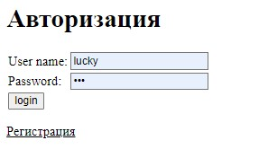
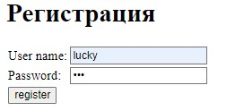
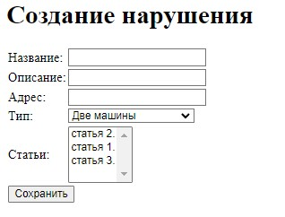
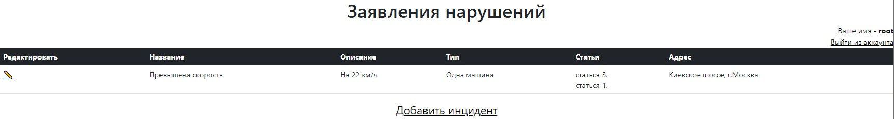
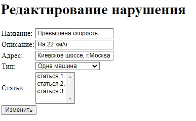

# job4j_accident_car
Проект - "Автонарушитель". 
- В системе две роли: обычный пользователь и автонарушитель. Пользователь добавляет описание автонарушения, а также есть возможность ее редактировать.
- Стек: Spring (MVC, Security, data), Tomcat.
- Визуализация:

